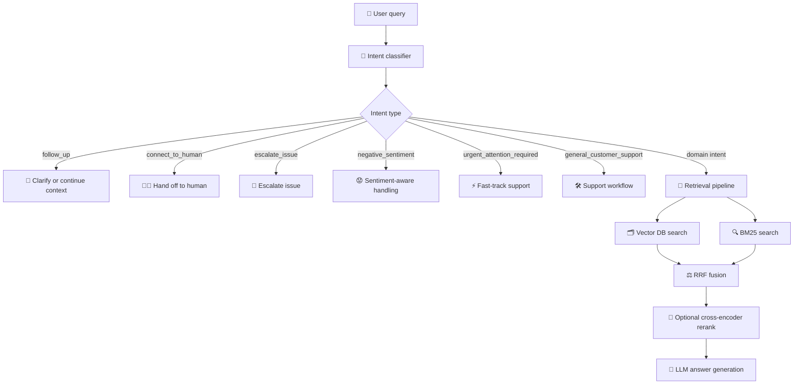

# rag_intent_classifier

A production-ready, offline intent classifier for RAG systems. It runs before retrieval so your application can detect follow-up, escalation, urgent, human-handoff, negative-sentiment, and general-support requests early and route them intelligently.

## Why this package exists

Most RAG pipelines focus on retrieval and generation, but they often skip the most important decision step: intent classification.

This package helps you identify whether a user query is:
- a normal domain request,
- a follow-up question,
- a request to connect to a human,
- an escalation,
- an urgent issue,
- or negative sentiment that should not trigger normal search.

That makes retrieval more accurate and reduces unnecessary document search.

## What it does

- Classifies intents using MiniLM embeddings and packaged classical ML models
- Returns human-readable labels for downstream routing
- Works offline with no external API dependency
- Supports a simple Python API and CLI

## Supported meta-intent labels

The current release surfaces these labels for routing-heavy RAG scenarios:

- follow_up
- connect_to_human
- escalate_issue
- negative_sentiment
- urgent_attention_required
- general_customer_support

These are especially useful for routing to a human, skipping standard retrieval, or narrowing search to the right support context.

## Architecture in a RAG pipeline



In practice, once the intent is classified, the retrieval step becomes smaller and more precise: the system can avoid irrelevant chunks, route to the right workflow, and focus on the most relevant evidence.

## Included capabilities

- 156 intents (150 CLINC + 6 additional meta-intents)
- MiniLM embeddings
- Multiple packaged classifier models
- Offline inference
- Human-readable labels
- Simple Python API and CLI

## Installation

Python 3.9 to 3.12 is the currently supported range for this package.

```bash
pip install rag_intent_classifier
```

## Quick start

```python
from rag_intent_classifier import infer_intent

print(infer_intent("How do I renew my policy?"))
```

## CLI usage

```bash
rag_intent_classifier "How do I renew my policy?"
```

## Development install

```bash
git clone https://github.com/yuvarajd2588/rag_intent_classifier.git
cd rag_intent_classifier
pip install -e .
```
