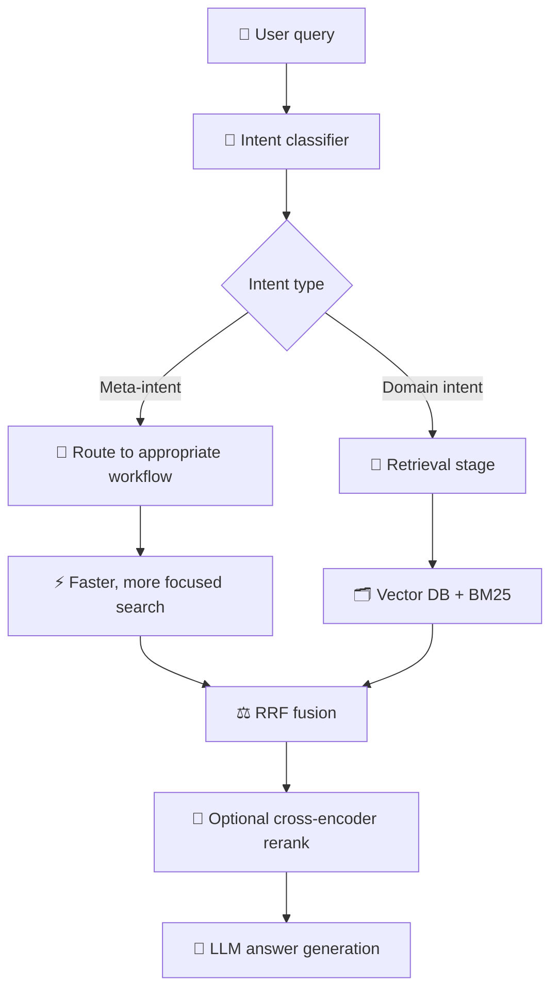

# rag_intent_classifier

A lightweight, production-ready, offline intent classifier for RAG systems. It sits before retrieval and routes user queries into the right workflow early.

## Why this package matters

Most RAG systems treat retrieval as the main decision point, but intent classification is often the missing first step. This package adds a reliable layer that detects meta-intents such as:

- follow_up
- connect_to_human
- escalate_issue
- negative_sentiment
- urgent_attention_required
- general_customer_support

These labels help reduce irrelevant retrieval and improve routing quality in support, customer-service, and knowledge-base applications.

## What the package provides

- 156 intents total (150 CLINC + 6 additional meta-intents)
- MiniLM-based embeddings
- Multiple packaged classical ML classifiers
- Human-readable labels for downstream logic
- Fully offline inference
- Simple Python API and CLI

## Installation

Python 3.9 to 3.12 is the currently supported range.

```bash
pip install rag_intent_classifier
```

## Quick usage

```python
from rag_intent_classifier import infer_intent

print(infer_intent("How do I renew my policy?"))
```

## RAG placement



This helps shrink the search space and route the request to the right handling path before the main retrieval step.
